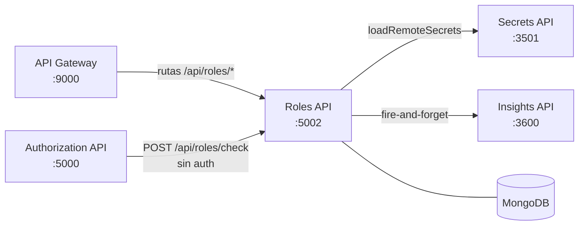
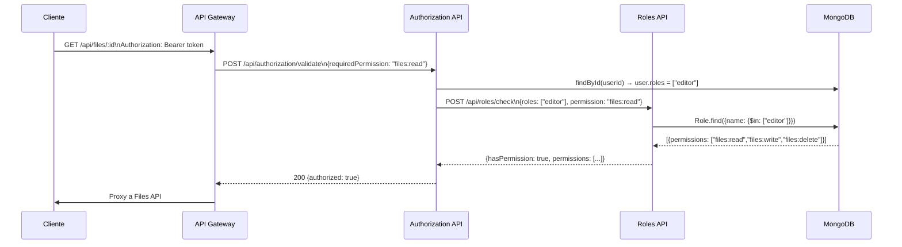
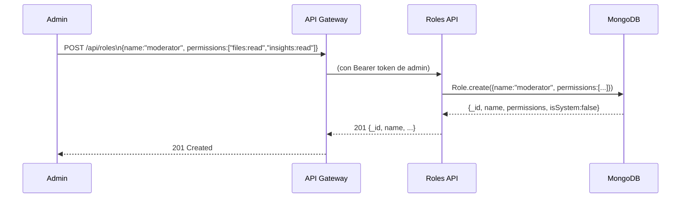

# Roles & Permissions API

Servicio de gestión de roles y permisos del ecosistema Dev Laoz. Define qué acciones puede realizar cada rol dentro de la plataforma, usando el formato `resource:action` (ej. `users:read`, `files:write`). Es consultado por la Authorization API en cada validación de permisos RBAC.

## Posición en la arquitectura



## Flujo de negocio

### Verificación de permiso (llamada interna desde Authorization API)



### Creación de rol personalizado



## Stack técnico

- **Node.js 18** / **Express 4**
- **MongoDB** via Mongoose (misma instancia que los demás servicios)
- **@dev-laoz/core** — carga de secretos, logging, auth middleware, rate limiting, Swagger

## Prerrequisitos

- Node.js 18+
- MongoDB 7+ corriendo
- `api-secrets` activo (para cargar `MONGO_URI` al arrancar)
- `api-insights` activo (para logging, opcional — falla silenciosamente)

## Variables de entorno

| Variable | Descripción | Valor en Docker |
|---|---|---|
| `PORT` | Puerto del servicio | `5002` |
| `MONGO_URI` | URI de MongoDB | `mongodb://mongo:27017/laoz` |
| `SECRETS_API_URL` | URL de Secrets API | `https://api-secrets:3501/api/secrets` |
| `AUTHORIZATION_API_URL` | URL de Authorization API | `http://authorization-api:5000/api/authorization/validate` |
| `INSIGHTS_HOST` | Host de Insights API | `api-insights` |
| `INSIGHTS_PORT` | Puerto de Insights API | `3600` |
| `RATE_LIMIT_MAX` | Límite de requests por ventana | `100` |
| `NODE_ENV` | Entorno | `production` |

## Instalación y ejecución local

```bash
# Instalar dependencias
npm install

# Configurar variables de entorno
cp .env.example .env
# Editar .env con valores locales

# Modo desarrollo
npm run dev

# Modo producción
npm start
```

El servidor arranca en `http://localhost:5002`.  
Swagger disponible en `http://localhost:5002/api-docs`.

Al arrancar, el servicio siembra automáticamente los 4 roles predeterminados del sistema si no existen.

## Endpoints

| Método | Ruta | Auth | Descripción |
|---|---|---|---|
| `GET` | `/api/roles` | Sí | Lista todos los roles |
| `POST` | `/api/roles` | Sí | Crea rol personalizado |
| `GET` | `/api/roles/name/:name` | Sí | Obtiene rol por nombre |
| `GET` | `/api/roles/:id` | Sí | Obtiene rol por ID |
| `PUT` | `/api/roles/:id` | Sí | Actualiza descripción y permisos |
| `DELETE` | `/api/roles/:id` | Sí | Elimina rol (no aplica a roles del sistema) |
| `POST` | `/api/roles/check` | No | Verifica si roles[] tienen un permiso (uso interno) |
| `GET` | `/api/roles/health` | No | Estado del servicio |

Ver [docs/API.md](docs/API.md) para referencia completa.

## Roles predeterminados del sistema

| Rol | `isSystem` | Permisos |
|---|---|---|
| `admin` | ✓ | Todos los permisos |
| `editor` | ✓ | `files:read/write/delete`, `insights:read` |
| `viewer` | — | `files:read`, `insights:read` |
| `user` | — | `files:read` |

Los roles marcados como `isSystem: true` no pueden eliminarse via API.

## Formato de permisos

Los permisos siguen el patrón `resource:action`:

| Recurso | Acciones disponibles |
|---|---|
| `users` | `read`, `write`, `delete` |
| `roles` | `read`, `write`, `delete` |
| `files` | `read`, `write`, `delete` |
| `secrets` | `read`, `write` |
| `insights` | `read`, `write` |
| `billing` | `read`, `write` |

## Integración con otros servicios

**Llamado por:**
- `authorization-api` → `POST /api/roles/check` (sin auth, servicio-a-servicio) para verificar permisos RBAC
- `api-gateway` → todas las demás rutas (con auth) para gestión de roles por parte de administradores

**Llama a:**
- `api-secrets` → carga `MONGO_URI` al arrancar
- `api-insights` → logging fire-and-forget
